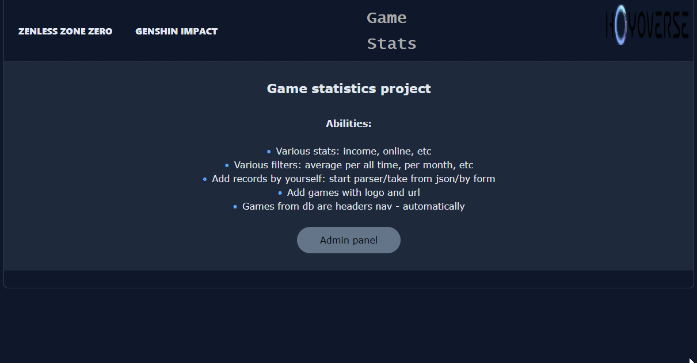
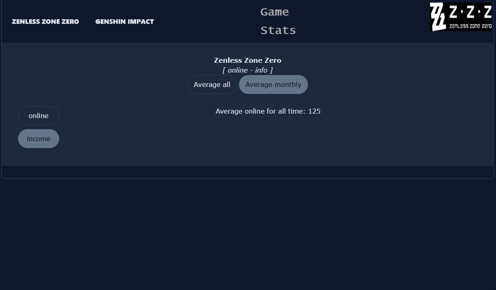
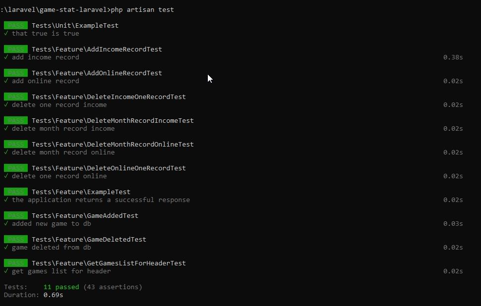

## 📝 Games statistics project[Laravel rebuild]

## 🧩 Description

Laravel-based version of my <a href="https://github.com/AlDemic/game-stats">previous</a> Game Statistics project.

Original project was written in pure PHP without frameworks.
This version rebuilds the same system using Laravel architecture.

Main goal — demonstrate understanding of framework-based backend development.

The system is built as internal analytical tool with a centralized entry point via index.php (URL routing + redirection).

## 🚀 Improvements Compared to PHP Version

- Laravel routing instead of custom router

- MVC architecture

- Blade templating

- Eloquent ORM

- FormRequest validation

- Service layer for business logic

- Events for logging actions

- Feature tests for admin API

- Storage API for parser files

## ⚙️ Technologies

* Laravel

* PHP

* MySQL

* Blade

* Eloquent ORM

* Feature Tests

* REST API

## 🧱 Architecture

Main architecture components:

Request -> Route -> Controller -> Service -> Model(Eloquent) -> Database

Used patterns:

* Service Layer

* Event-based logging

* FormRequest validation

* API Resources

* Feature testing

## 🧩 Features

* Game statistics storage

* Online / income tracking

* JSON import

* External parser integration

* Monthly filtering

* Average calculations

* Dynamic navigation by games

* Admin panel

* Logging system

## 🧪 Testing

Admin API covered with Feature tests.

Examples:

- add record

- delete record

- validation checks

- database assertions

## 🗄 Database

1) Open file .env in root folder and adjust SQL connection (I used MySQL as main db, for tests - sqlite);
2) Go to root folder by console and start migration: php artisan migrate. This command will create basic tables for laravel and special tables for this project: games, onlines, incomes.

## 📸 Demonstration

## 📸 Screenshots
- Additional screenshots can find in same folder: /screenshots/

## ⚙️ Running the Module(!)

git clone
cd project

composer install

cp .env.example -> .env

php artisan migrate

php artisan serve

Admin panel is simple. Session is created for 24h. To login use username: "admin" and password: "1212" - without "".

